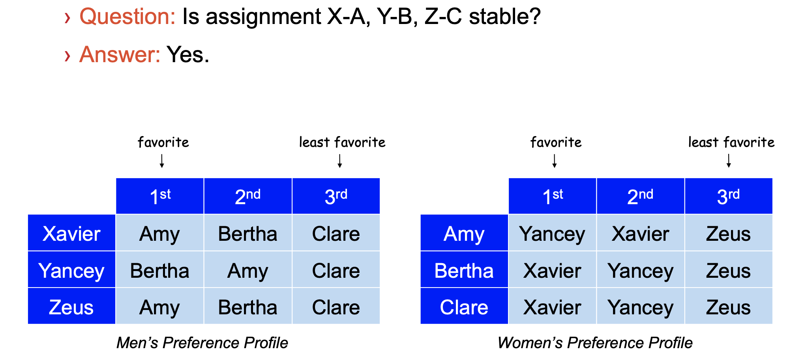
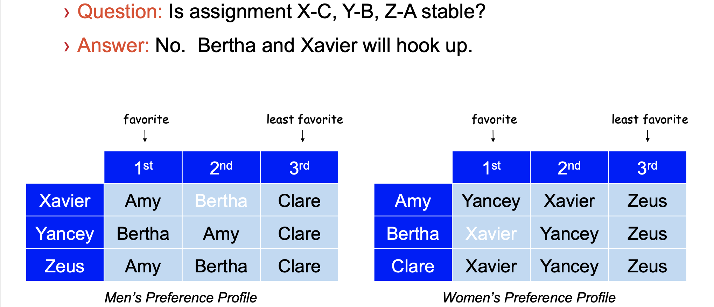
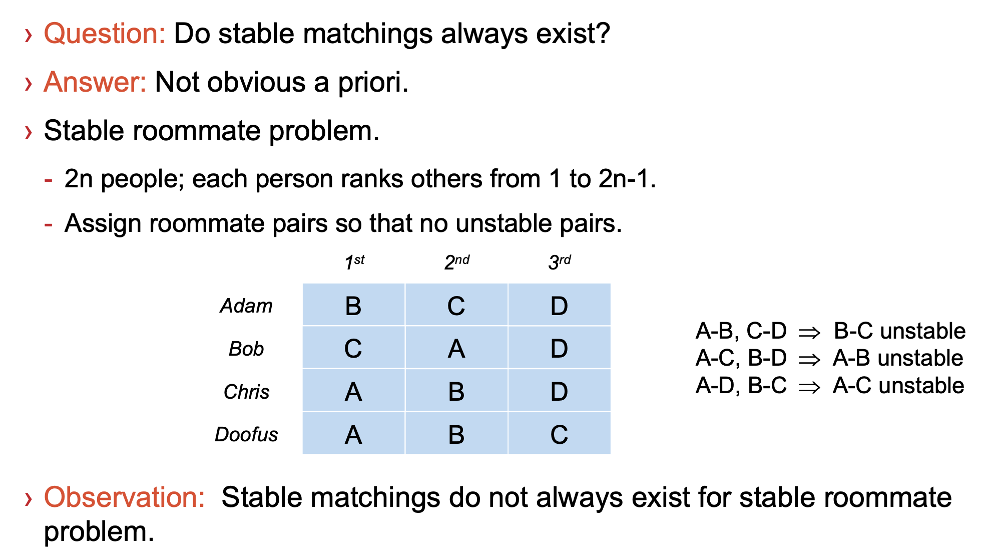

# Gale-Shapley algorithm
To solve the stable matching problems.

## Stable Matching Problem
**Goal** Given a set of preferences among hospitals and medical school students, design a self-enforcing admissions process.

**Unstable** pair: applicant x and hospital y are unstable if: 
- x prefers y to its assigned hospital.
- y prefers x to one of its admitted students.

**Stable** assignment. Assignment with no unstable pairs.
- Natural and desirable condition.
- Individual self-interest will prevent any applicant/hospital deal from being made.

## Judge stable
For two couples: man1-woman1, man2-woman2(two pairs),
 - man1 prefer woman2 than his own wife woman1, 
 - woman2 also prefer man1 than her own husband man2.


There are three pairs to analysis:
 for X-A, Y-B: X love his A best, stable.
 for X-A, Z-C: X love his A best, stable.
 for Y-B, Z-C: Y love his B best, stable.


Because for X-C, Y-B:
- X prefer B than his own wife C,
- Y also prefer X than her own husband Y.

## Stable Roommate Problem 


## Propose-and-Reject Algorithm（GS）
Traverse man, 
traverse woman, 
each woman has three situations.

```swift

Initialize each person to be free.
while (some man is free and hasn't proposed to every woman) 
{
    Choose such a man m
    w ← 1st woman on m's list to whom m has not yet proposed
    if (w is free) {
        assign m and w to be engaged
    } else if (w prefers m to her fiancé m') {
        assign m and w to be engaged, and m' to be free
    } else {
        w rejects m
    }
}
```
O(n^2)

## Proof of Correctness: Termination
This algorithm can use termination method to proof its correctness. There are two observations help us understading.

- Men propose to women in decreasing order of preference.
- Once a woman is matched, she never becomes unmatched; she only "trades up."

**Claim.** Algorithm terminates after at most n^2 iterations of while loop. 
**Proof.** Each time through the while loop a man proposes to a new woman. There are only n^2 possible proposals.

## Efficient Implementation
Assume men are named 1, ..., n, women are 1', ..., n'.
1. Men proposing
- For each man, maintain a list of women, ordered by preference.
- Maintain an array count[m]that counts the number of proposals made by man m.
2. Engagements
- Maintain a list of free men, e.g., in a queue.
- Maintain two arrays wife[m] and husband[w].
    -- set entry to 0 if unmatched
    -- if m matched to w, then wife[m] ← w, husband[w] ← m

### Understanding the Solution
Question: For a given problem instance, there may be several stable matchings. Do all executions of Gale-Shapley yield the same stable matching? If so, which one?

No, there may have multiple stable matchings.

Tips:
1. Man m is a **valid partner** of woman w if there exists some stable matching in which they are matched.
2. Man-optimal assignment. Each man receives best valid partner.
3. Claim. All executions of GS yield man-optimal assignment, which is a
stable matching!
    - No reason a priori to believe that man-optimal assignment is perfect, let alone stable.
    - Simultaneously best for each and every man.

## Summary
1. Stable matching problem. Given preference profiles of n men and n women, find a stable matching.
2. Gale-Shapley algorithm. Finds a stable matching in O(n2) time.
3. Man-optimality. In version of GS where men propose, each man receives
best valid partner.


## 考点 
1. (m1-w1, m2-w2, m3-w3), 是否stable matching？

- m1：观察是否有w在原配w1之前，若有(比如w2)，再观察w2对m1的优先级是否在原配w2之前，若在，则unsatble.
以此类推 m2, m3.

    - 解题技巧: 把原配放第一位的永不出轨。

2. 判断一个人的 valid partner 是哪些?

- 先用G-S算法解出m propose w、w propose m两种稳定组合，再取并集（实际上应调换谁先选，用GS算法把所有可能的m-w和w-m匹配组合都找到，再取并集）

3. 时间复杂度分析:
- 最极端情况，m1右移n位，m2右移n-1位: n + (n-1) + ... + 1 = (n+1)*n / 2


