# Database (COMP9120)

## Database Design Sequence

1. Requirements analysis
2. Conceptual design(EER)
3. Logical design  
4. Schema Refinement 
5. Physical design
6. App & Security design

### Conceptual design(EER)

A technique for understanding and capturing
business information requirements graphically

#### Entity Relationship Model

**Entity**: John Doe, unit COMP9120, account 4711
**Entity Type**: students,courses,accounts
**Attribute**: people have IDs, names and addresses
**Domain**: possible values of an attribute
- Simple and composite attributes.
- Single-valued and multi-valued attributes.

**Key**: minimal set of attributes that uniquely identifies an entity in the set (several such Candidate Keys possible), such as student ID.

Graphical Representation in **E-R Diagram**:

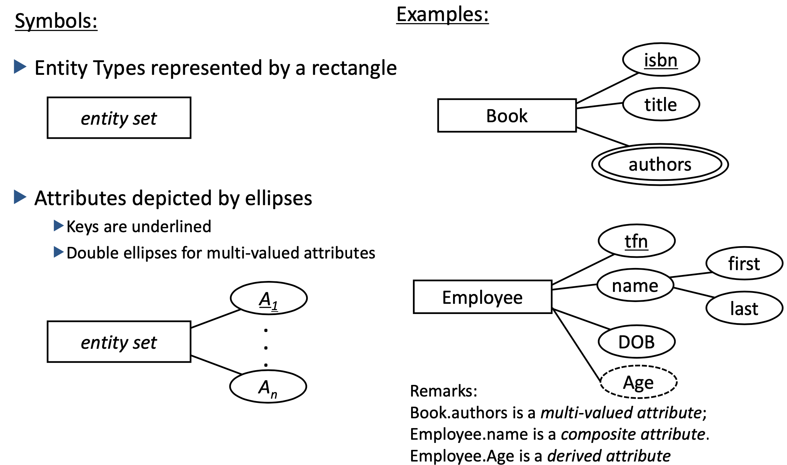

**Relationship**: relates two or more entities
Here are 3 relationships: 
- John is **enrolled** in COMP9120.
- Terry is **enrolled** in COMP9120.
- Ritter is **enrolled** in COMP9120.

**Relationship Type**
Student (entity set) related to Courses (entity set) by **EnrolledIn** (relationship type).

Diamond represents **relationship type**:

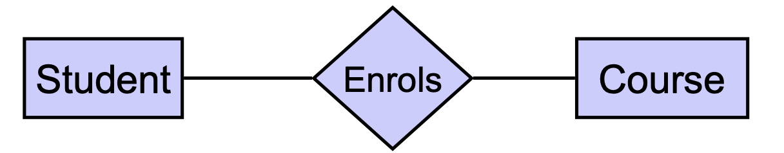

**Degree of a Relationship**:

Unary Relationship (Recursive): employee manages employee

Binary Relationship: student enroll in the USYD.

Ternary Relationship: vendor(供应商), Warehouse(仓库), Part, related by the verb "ships".

**Relationship-Attribute**: Relationships can also have additional properties

- E.g.,John enrols in COMP9120 in the second semester 2020
value of the **second semester** is additional attribute.

**Relationship-Role**: Each participating entity can be named with an explicit role
- E.g. John is value of Student role, COMP9120 value of Subject role
- useful for relationship that relate elements of the same entity type

**Relationship Type Schema**:
- Relationship name
- Role names (or names of participating entity sets) – this is optional
- Relationship attributes (+domains)

**Graphical Representation of Relationships in ERD**

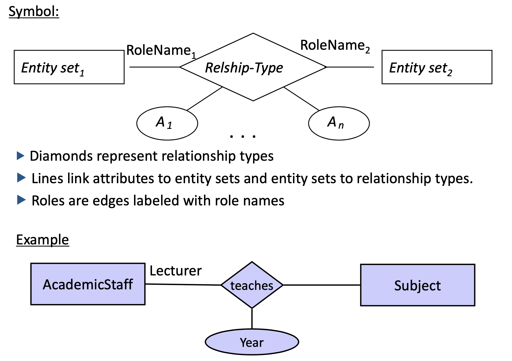

**Key of Relationship Types**

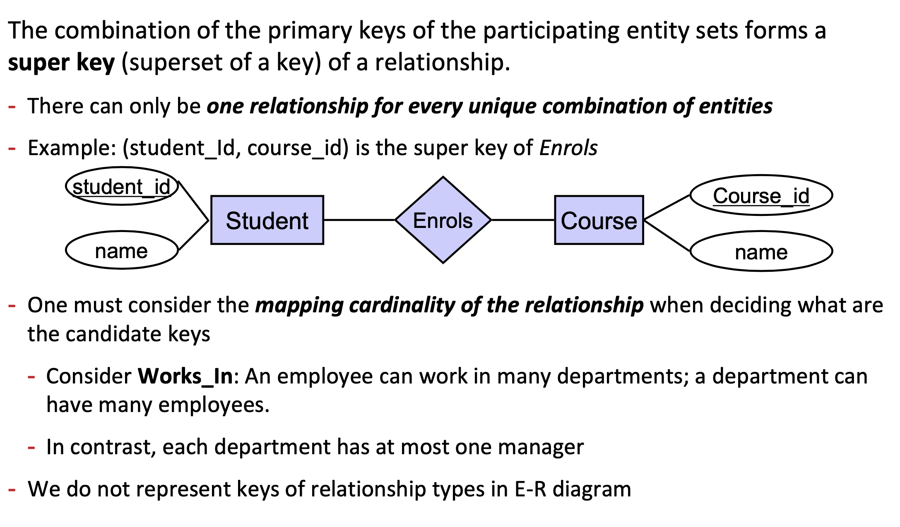

Modeling something as a relationship makes it unique; if not appropriate, just a create new entity instead of a relationship.

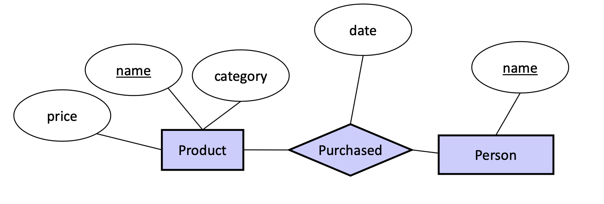
A person can only buy a specific product once (on one date)

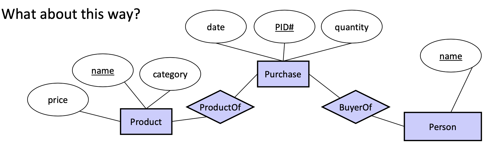

Now we can have multiple purchases per product, person pair!

**Mathematical Definition of Relationship**
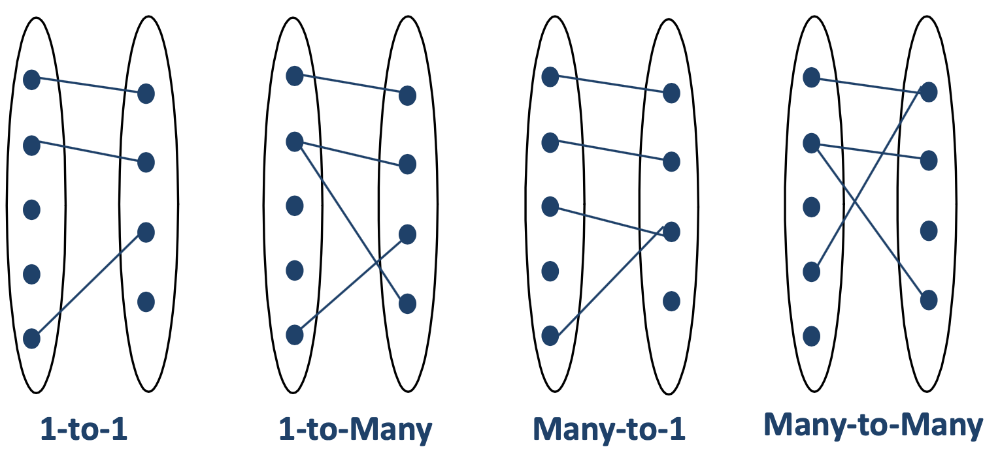

**Key Constraints**
实体越多越unique，属性越多越subclass,粗线every细线A

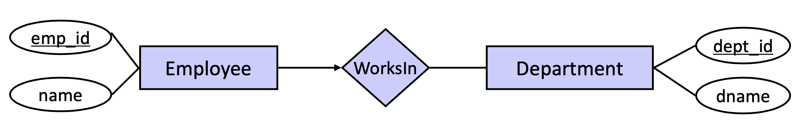
An employee works in at most one department.(N:1)

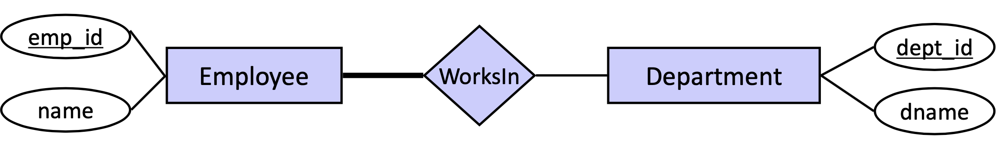

Every employee works in at least one department.**(total participation)**

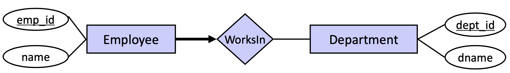
Every employee works in exactly one department.(N:1)

**Cardinality Constraint**
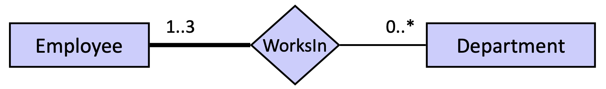
Every employee works in 1 to 3 departments.

**Weak entity type**: An entity type that does not have a self-contained primary key.(1:N)

- The **discriminator** (or **partial key**) of a weak entity type is the set of attributes that
distinguishes among all the entities of a weak entity type related to the same owning entity.

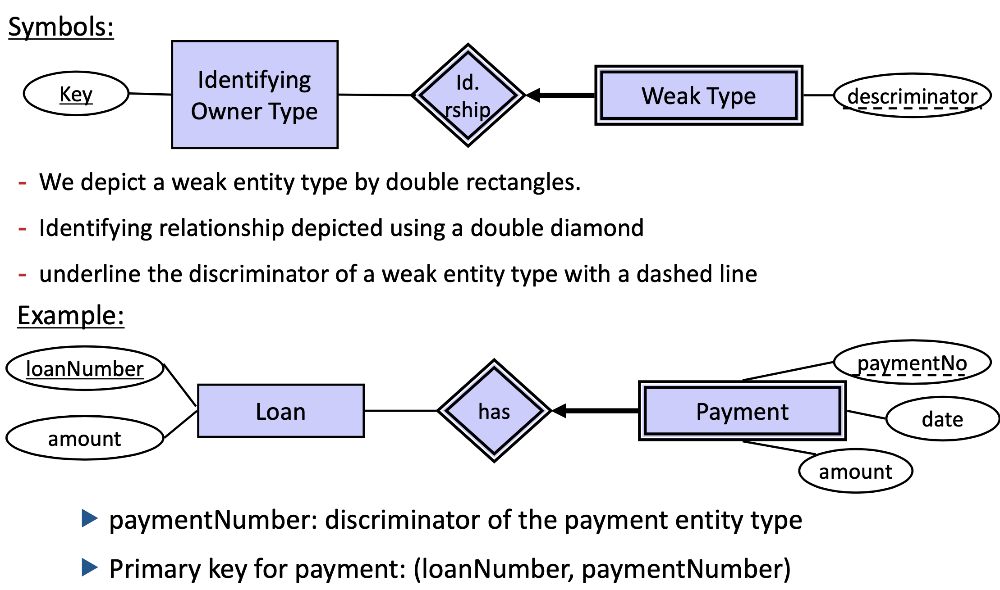

**EER Model**
ER model in its original form did not support 
- SPECIALIZATION/ GENERALIZATION
- ABSTRACTIONS (‘aggregation’)

**Generalisation / Specialisation / Inheritance**:

Two entity types E and F are in an IsA-relationship (“F is a E”), if
- the set of attributes of F is a superset of the set of attributes of E, and 
- the entity set F is a subset of the entity set of E (“each f is an e”)

One says that F is a specialisation of E (F is subclass) and E is a generalisation of F (E is superclass).
- Example: Student is a subclass of Person

**Attribute inheritance**
 A lower-level (subclass) entity type inherits all the attributes and relationship participations of its supertype.

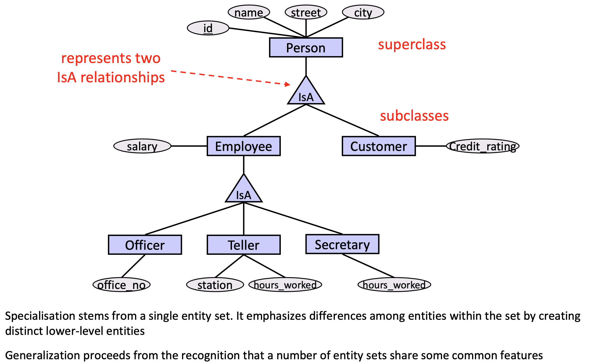

**(lower-level = subclass = more attributes)**

**Constraints on IsA Hierarchie** (?)
1. Overlap Constraints
    - Disjoint: an entity can belong to only one lower-level entity set
    - Overlapping: an entity can belong to more than one lower-level entity set

2. Covering Constraints
    - Total: an entity must belong to one of the lower-level entity sets.
    - Partial (the default): an entity need not belong to one of the lower-level entity sets

**Aggregation**: Treat relationship as an abstract entity

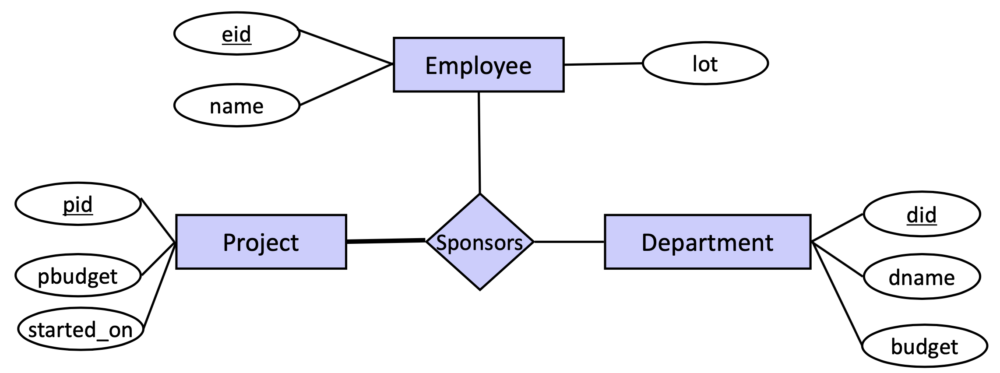

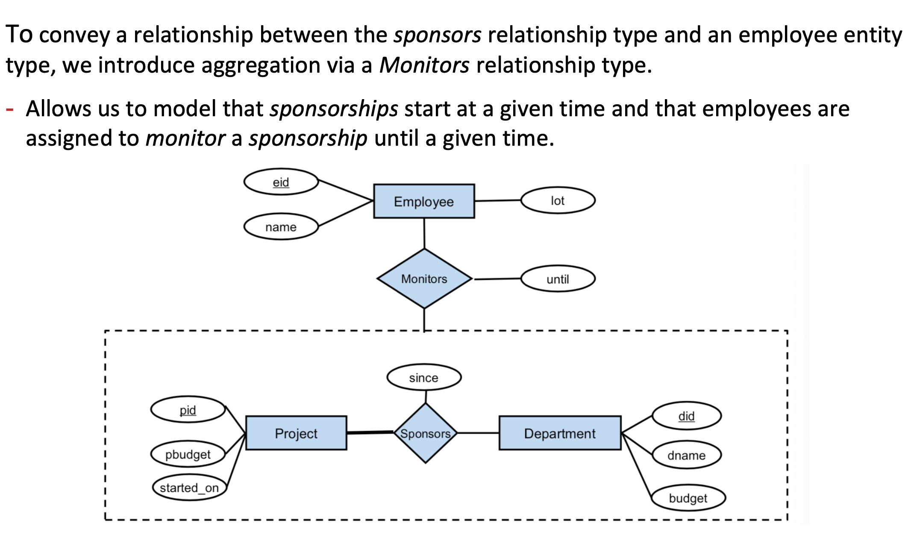