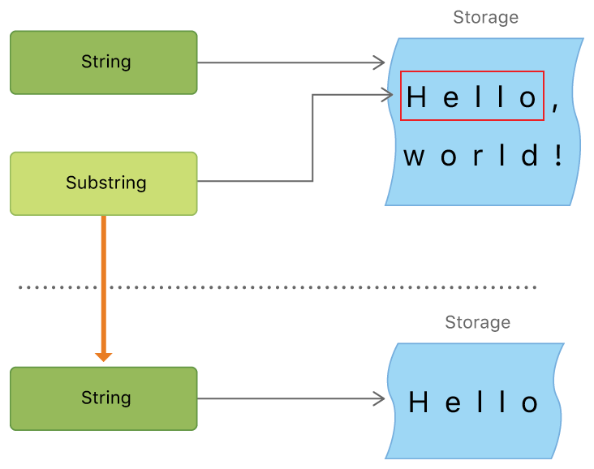

# Swift 5.

## Basic 

### Value
The value of a constant can’t be changed once it’s set, whereas a variable can be set to a different value in the future.
```swift
let maxNumberOfLoginAttempts = 10
var currentLoginAttempt = 0
var x = 0.0, y = 0.0, z = 0.0
```

### Type annotation


```swift
var welcomeMessage: String
welcomeMessage = "Hello"
```

```swift
var red, green, blue: Double
```

### Naming constants and variables

```swift
let π = 3.1415953
let str = "Terry Pei"
let 🐶🐮 = "dogcow"
```


```swift
let languageName = "Swift"
languageName = "Swift++"
// This is a compile-time error: languageName cannot be changed.

var friendlyWelcome = "Hello!"
friendlyWelcome = "Bonjour!"
// friendlyWelcome is now "Bonjour!"
```

### Print
```swift
print("FriendlyWelcome is \(friendlyWelcome)")
```

### Int, Double, String
```swift

```
```swift
let paddedDouble = 000123.456
let oneMillion = 1_000_000
let justOverOneMillion = 1_000_000.000_000_1
```

### Tuples
Tuples group multiple values into a single compound value. The values within a tuple can be of any type and don’t have to be of the same type as each other.
```swift
let http404Error = (404, "Not Found")
// http404Error is of type (Int, String)

print("The status code is \(http404Error.0)")
// Prints "The status code is 404"
print("The status message is \(http404Error.1)")
// Prints "The status message is Not Found"

let (statusCode, statusMessage) = http404Error
```

```swift
let http200Status = (statusCode: 200, description: "OK")

print("The status code is \(http200Status.statusCode)")
// Prints "The status code is 200"
print("The status message is \(http200Status.description)")
// Prints "The status message is OK"
```
## Optionals
value + nil, need unwrap.
nil is not a pointer in swift
```swift
var serverResponseCode: Int? = 404
// serverResponseCode contains an actual Int value of 404
serverResponseCode = nil
// serverResponseCode now contains no value

var surveyAnswer: String?
// surveyAnswer is automatically set to nil
```
Forced Unwrapping

```swift
if value != nil {
    print("value contains some value.")
}
```
Optional Binding
 use optional binding to find out whether an optional contains a value, and if so, to make that value available as a temporary constant or variable.

```swift
if let actualNumber = Int(possibleNumber) {
    print("The string \"\(possibleNumber)\" has an integer value of \(actualNumber)")
} else {
    print("The string \"\(possibleNumber)\" could not be converted to an integer")
}

if let firstNumber = Int("4"), let secondNumber = Int("42"), firstNumber < secondNumber && secondNumber < 100 {
    print("\(firstNumber) < \(secondNumber) < 100")
}
// Prints "4 < 42 < 100"
```
Implicitly Unwrapped Optionals
    sure always have a value. 
    `String!` rather than `String?`
    The following example shows the difference in behavior between an optional string and an implicitly unwrapped optional string when accessing their wrapped value as an explicit String:

```swift
let possibleString: String? = "An optional string."
let forcedString: String = possibleString! // requires an exclamation point

let assumedString: String! = "An implicitly unwrapped optional string."
let implicitString: String = assumedString // no need for an exclamation point
```

```swift
let optionalString = assumedString
// The type of optionalString is "String?" and assumedString isn't force-unwrapped.
```

### Error Handling
A function indicates that it can throw an error by including the throws keyword in its declaration.
```swift
func canThrowAnError() throw {
    // this function may or may not throw an error
}

do {
    try canThrowAnError()
    // no error was thrown
} catch {
    // an error was thrown
}
```
In the following example, the makeASandwich() function will throw an error if no clean dishes are available or if any ingredients are missing. Because makeASandwich() can throw an error, the function call is wrapped in a try expression. By wrapping the function call in a do statement, any errors that are thrown will be propagated to the provided catch clauses.
```swift
func makeASandwich() throws {
    // ...
}

do {
    try makeASandwich()
    eatASandwich()
} catch SandwichError.outOfCleanDishes {
    washDishes()
} catch SandwichError.missingIngredients(let ingredients) {
    buyGroceries(ingredients)
}
```
### Assertions and Preconditions
If the Boolean condition in the assertion or precondition evaluates to true, code execution continues as usual. If the condition evaluates to false, the current state of the program is invalid; code execution ends, and your app is terminated.

Debugging with Assertions
```swift
let age = -3
assert(age >= 0, "A person's age can't be less than zero.")
// This assertion fails because -3 is not >= 0.
```
If the code already checks the condition, you use the assertionFailure(_:file:line:) function to indicate that an assertion has failed. For example:

```swift
if age > 10 {
    print("You can ride the roller-coaster or the ferris wheel.")
} else if age >= 0 {
    print("You can ride the ferris wheel.")
} else {
    assertionFailure("A person's age can't be less than zero.")
}
```
Enforcing Preconditions
```swift

```
```swift

```
```swift

```
```swift

```
```swift

```

## Operators
 
 \+ - * % == != > < >= <=
 !a a&&b a||b
 question ? answer1 : answer2

### Nil-coalescing operator
a ?? b
```swift
let defaultColorName = "red"
var userDefinedColorName: String?   // defaults to nil

var colorNameToUse = userDefinedColorName ?? defaultColorName
// userDefinedColorName is nil, so colorNameToUse is set to the default of "red"

userDefinedColorName = "green"
colorNameToUse = userDefinedColorName ?? defaultColorName
// userDefinedColorName is not nil, so colorNameToUse is set to "green"
```

### Range Operator

```swift
for index in 1...5 {
    print("\(index) times 5 is \(index * 5)")
}

let names = ["terry", "ritter", "stephen", "jack"]
for i in range names.count {
    print("\(names[i])")
}

for name in names[2...] {
    print(name)
}
for name in names[...2] {
    print(name)
}
for name in names[..<2] {
    print(name)
}
```

```swift
let range = ...5
range.contains(7)   // false
range.contains(4)   // true
range.contains(-1)  // true
```

## Strings and characters
Swift’s String type is bridged with Foundation’s NSString class. Foundation also extends String to expose methods defined by NSString. This means, if you import Foundation, you can access those NSString methods on String without casting.

For more information about using String with Foundation and Cocoa, see [Bridging Between String and NSString](https://developer.apple.com/documentation/swift/string#2919514).

```swift
let singleString = "This is a single string."
let multilineString = """
 These are multiline strings.
"""
```

### Concatenating strings and characters

```swift
let string1 = "hello"
let string2 = "ritter"
var welcame = string1 + string2

var instruction = "look over"
instruction += string2

let exclamationMark: Character = "!"
welcome.append(exclamationMark)
```


### Unicode
Unicode is an international standard for encoding, representing, and processing text in different writing systems. It enables you to represent almost any character from any language in a standardized form, and to read and write those characters to and from an external source such as a text file or web page. Swift’s String and Character types are fully Unicode-compliant, as described in this section.
Behind the scenes, Swift’s native String type is built from Unicode scalar values. A Unicode scalar value is a unique 21-bit number for a character or modifier, such as U+0061 for LATIN SMALL LETTER A ("a"), or U+1F425 for FRONT-FACING BABY CHICK ("🐥").

Note that not all 21-bit Unicode scalar values are assigned to a character—some scalars are reserved for future assignment or for use in UTF-16 encoding. Scalar values that have been assigned to a character typically also have a name, such as LATIN SMALL LETTER A and FRONT-FACING BABY CHICK in the examples above.
```swift
let precomposed: Character = "\u{D55C}"                  // 한
let decomposed: Character = "\u{1112}\u{1161}\u{11AB}"   // ᄒ, ᅡ, ᆫ
// precomposed is 한, decomposed is 한

let regionalIndicatorForUS: Character = "\u{1F1FA}\u{1F1F8}"
// regionalIndicatorForUS is 🇺🇸
```

### Accessing and modifying a string
You access and modify a string through its methods and properties, or by using subscript syntax.

#### string indices

```swift
let greeting = "Guten Tag!"
greeting[greeting.startIndex]
// G
greeting[greeting.index(before: greeting.endIndex)]
// !
greeting[greeting.index(after: greeting.startIndex)]
// u
let index = greeting.index(greeting.startIndex, offSetBy: 7)
greeting[index]
// a
```

Attempting to access an index outside of a string’s range or a Character at an index outside of a string’s range will trigger a runtime error.

```swift
greeting[greeting.endIndex] // Error
greeting.index(after: greeting.endIndex) // Error
```
Use the indices property to access all of the indices of individual characters in a string.

```swift
for index in greeting.indices {
    print("\(greeting[index])", terminator: "")
}
// prints "G u t e n  T a g ! "
```

To insert a charactor, String.insert(_:, at:), 
To insert a string, String.insert(contentsOf: , at: ))

```swift
var welcome = "hello"
welcome.insert("!", at: welcome.endIndex)
//"hello!"

welcome.insert(contentsOf: " there", at: welcome.index(before: welcome.endIndex))
//"hello there"
```

To remove a charactor, String.remove(_:, at:), 
To remove a string, String.remove(contentsOf:, at:)

```swift
welcome.remove(at: welcome.index(before: welcome.endIndex))
//welcome now equals "hello there"
let range = welcome.index(welcome.endIndex, offsetBy: -6) ..< welcome.endIndex
welcome.removeSubrange(range)
// welcome now equals "hello"
```

```swift
var emptyString = ""  
emptyString.isEmpty() // True
emptyString.count() // 0
```

### Substrings
When you get a substring from a string—for example, using a subscript or a method like prefix(_:)—the result is an instance of **Substring** , not another **String**. When you’re ready to store the result for a longer time, you convert the substring to an instance of String. For example:

```swift
let greeting = "Hello World!"
let index = greeting.firstIndex(of: ",") ?? greeting.endIndex
let beginning = greeting[..<index]
// beginning is "Hello", but beginning is a Substring now.
// Convert the result to a String for long-term storage.
let newString = String(beginning)
```
memory


### Comparing Strings
Swift provides three ways to compare textual values: string and character equality, prefix equality, and suffix equality.
equality
```swift
let quotation = "We're a lot alike, you and I."
let sameQuotation = "We're a lot alike, you and I."
if quotation == sameQuotation {
    print("These two strings are considered equal")
}
// Prints "These two strings are considered equal"
```
prefix equality 
String.hasPrefix(_: )
```swift
let romeoAndJuliet = [
    "Act 1 Scene 1: Verona, A public place",
    "Act 1 Scene 2: Capulet's mansion",
    "Act 1 Scene 3: A room in Capulet's mansion",
    "Act 1 Scene 4: A street outside Capulet's mansion",
    "Act 1 Scene 5: The Great Hall in Capulet's mansion",
    "Act 2 Scene 1: Outside Capulet's mansion",
    "Act 2 Scene 2: Capulet's orchard",
    "Act 2 Scene 3: Outside Friar Lawrence's cell",
    "Act 2 Scene 4: A street in Verona",
    "Act 2 Scene 5: Capulet's mansion",
    "Act 2 Scene 6: Friar Lawrence's cell"
]

var act1SceneCount = 0
for scene in romeoAndJuliet {
    if scene.hasPrefix("Act 1 ") {
        act1SceneCount += 1
    }
}
print("There are \(act1SceneCount) scenes in Act 1")
// Prints "There are 5 scenes in Act 1"
```
String.hasSuffix(_: )
```swift
var mansionCount = 0
var cellCount = 0
for scene in romeoAndJuliet {
    if scene.hasSuffix("Capulet's mansion") {
        mansionCount += 1
    } else if scene.hasSuffix("Friar Lawrence's cell") {
        cellCount += 1
    }
}
print("\(mansionCount) mansion scenes; \(cellCount) cell scenes")
// Prints "6 mansion scenes; 2 cell scenes"
```


### Unicode Representations of Strings
let dogString = "Dog‼🐶"

UTF-8 representation: String.utf8
```swift
for codeUnit in dogString.utf8 {
    print("\(codeUnit) ", terminator: "")
}
print("")
// Prints "68 111 103 226 128 188 240 159 144 182 "
```
UTF-16 representation: String.utf16
```swift
for codeUnit in dogString.utf16 {
    print("\(codeUnit) ", terminator: "")
}
print("")
// Prints "68 111 103 8252 55357 56374 "
```
Unicode Scalar Representation: String.unicodeScalars
```swift
for scalar in dogString.unicodeScalars {
    print("\(scalar) ")
}
// D
// o
// g
// ‼
// 🐶

for scalar in dogString.unicodeScalars {
    print("\(scalar.value) ", terminator: "")
}
print("")
// Prints "68 111 103 8252 128054 "
```

## Collection Types

Arrays, Sets, Dictionaries

Arrays are ordered collections of values. Sets are unordered collections of unique values. Dictionaries are unordered collections of key-value associations.

### Array
Array.append(), Array.remove(at:),  
Array.insert(_:, at:), Array.isEmpty()
(index, value) = Array.enumerate()
```swift
var someInts = [Int]()
print("someInt has \(someInts.count) items")

someInts.append(3)

var threeDouble = Array(repeating: 0.0, count: 3)
var anotherThreeDouble = Array(repeating: 2.5, count: 3)
var sixDouble = threeDouble + anotherThreeDouble
```

```swift
var shoppingList = ["Eggs", "Milk", "Flour"]
// or shoppingList: [String] = ["Eggs", "Milk", "Flour"]
shoppingList += ["Baking Powder", "Chocolate Spread", "Cheese", "Butter"]

shoppingList[4...6] = ["Bananas", "Apples"]
shoppingList.insert("Maple Syrup", at: 0)
let mapleSyrup = shoppingList.remove(at: 0)
let apples = shoppingList.removeLast()

```

```swift
for item in shoppingList {
    print(item)
}

for (index, value) in shoppingList.enumerate() {
    print("Item \(index + 1): \(value)")
}
```

### Sets

isEmpty(), contains(), insert(), remove()
```swift
var letters = Set<character>()
var favoriteGenres: Set = ["Rock", "Classical", "Hip hop"]
//var favoriteGenres: Set<String> = ["Rock", "Classical", "Hip hop"]
```

union, intersection, subtracting, symmetricDifference
```swift
oddDigits.union(evenDigits).sorted()
// [0, 1, 2, 3, 4, 5, 6, 7, 8, 9]
oddDigits.intersection(evenDigits).sorted()
// []
oddDigits.subtracting(singleDigitPrimeNumbers).sorted()
// [1, 9]
oddDigits.symmetricDifference(singleDigitPrimeNumbers).sorted()
// [1, 2, 9]
```
isSubset(of: ), isSuperset(of: ), isDisjoint(with: )

Use the “is equal” operator (==) to determine whether two sets contain all of the same values.
Use the **isSubset(of:)** method to determine whether all of the values of a set are contained in the specified set.
Use the **isSuperset(of:)** method to determine whether a set contains all of the values in a specified set.
Use the **isStrictSubset(of:)** or isStrictSuperset(of:) methods to determine whether a set is a subset or superset, but not equal to, a specified set.
Use the **isDisjoint(with:)** method to determine whether two sets have no values in common.

```swift
let houseAnimals: Set = ["🐶", "🐱"]
let farmAnimals: Set = ["🐮", "🐔", "🐑", "🐶", "🐱"]
let cityAnimals: Set = ["🐦", "🐭"]

houseAnimals.isSubset(of: farmAnimals)
// true
farmAnimals.isSuperset(of: houseAnimals)
// true
farmAnimals.isDisjoint(with: cityAnimals)
// true
```
### Dictionaries
[Key: Value]
Note: A dictionary Key type must conform to the Hashable protocol, like a set’s value type.
```swift
var airports = ["YYZ": "Toronto Pearson", "DUB": "Dublin"]
```
There are two ways to update airports.
1.
```swift
airports["LHR"] = "London Heathrow"
```
2. As an alternative to subscripting, use a dictionary’s **updateValue(_:, forkey)** method to set or update the value for a particular key. Like the subscript examples above, the **updateValue(_:,forKey:)** method sets a value for a key if none exists, or updates the value if that key already exists. Unlike a subscript, however, the **updateValue(_:forKey:)** method returns the old value after performing an update. This enables you to check whether or not an update took place.

The **updateValue(_:forKey:)** method returns an optional value of the dictionary’s value type. For a dictionary that stores String values, for example, the method returns a value of type String?, or “optional String”. This optional value contains the old value for that key if one existed before the update, or nil if no value existed:

```swift
if let oldValue = airports.updateValue("Dublin Airport", forKey: "DUB") {
    print("The old value for DUB was \(oldValue).")
}
// Prints "The old value for DUB was Dublin."

if let airportName = airports["DUB"] {
    print("The name of the airport is \(airportName).")
} else {
    print("That airport is not in the airports dictionary.")
}
// Prints "The name of the airport is Dublin Airport."

```
Iteration
```swift
for (airportCode, airportName) in airports {
    print("\(airportCode): \(airportName)")
}
// LHR: London Heathrow
// YYZ: Toronto Pearson

for airportCode in airports.keys {
    print("Airport code: \(airportCode)")
}
// Airport code: LHR
// Airport code: YYZ

for airportName in airports.values {
    print("Airport name: \(airportName)")
}
// Airport name: London Heathrow
// Airport name: Toronto Pearson
```
If you need to use a dictionary’s keys or values with an API that takes an Array instance, initialize a new array with the keys or values property:
```swift
let airportCodes = [String](airports.keys)
// airportCodes is ["LHR", "YYZ"]

let airportNames = [String](airports.values)
// airportNames is ["London Heathrow", "Toronto Pearson"]
```

## Control flow

### For
    
### while