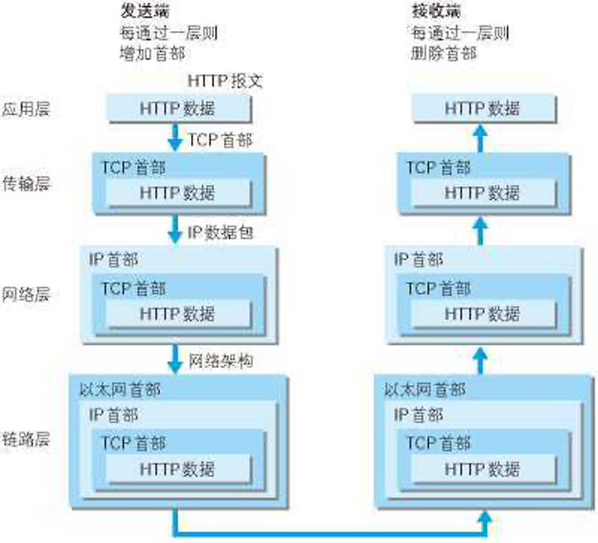
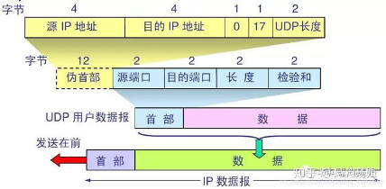
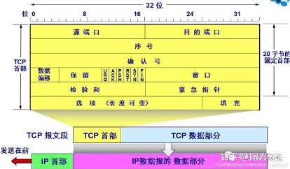
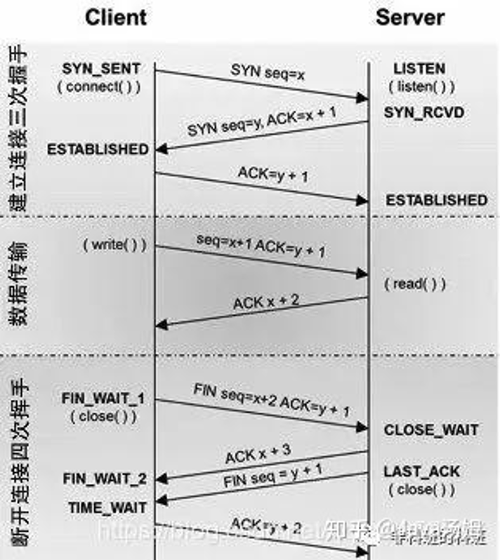
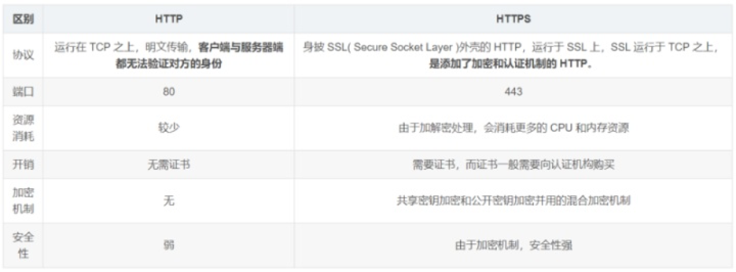

# Computer network

发送端在层与层之间传输数据时，每经过一层时会被打上一个该层所属的首部信息。反之，接收端在层与层之间传输数据时，每经过一层时会把对应的首部信息去除。对某一层的改造不影响其它层。

**应用层** 应用进程间的交互，不同应用对应不同协议：域名系统 DNS，支持万维网应用的 HTTP 协议，支持电子邮件的 SMTP 协议

**传输层** 两台主机进程之间的数据传输服务 TCP/UDP
**网络层** 分组转发 IP协议
**数据链路层** 将网络层交下来的 IP 数据报组装成帧，在两个相邻节点间的链路上传送帧。每一帧包括数据和必要的控制信息（如同步信息，地址信息，差错控制等）。
**物理层** 比特流透明传送 

## TCP三次握手，四次挥手

 

核心：确认方ack=发起方seq+1，小ack是确认序号，大ACK：确认序号有效的标志位。
- 客户端发送：SYN=1,seq=client_seq(是一个随机数)
- 服务端发送：SYN=1,ACK=1,ack=client_seq +1，seq=server_seq(Client收到确认后，检查ack是否为client_seq +1)
- 客户端发送：SYN=0, ACK=1, ack = server_seq+1

完整过程：
 

#### 为什么TCP连接的时候是3次？2次不可以吗？

假设**第二次**握手时如果服务端发给客户端的确认报文段**丢失**，若只有两次握手, 服务端就会一直在那里等着客户端，浪费资源。
如果是三次握手，即便发生丢包也不会有问题，比如如果第三次握手客户端发的确认ack报文丢失，服务端在一段时间内没有收到确认ack报文的话就会重新进行第二次握手。

#### 为什么TCP连接的时候是3次，关闭的时候却是4次？
因为只有在客户端和服务端都没有数据要发送的时候才能断开TCP。而客户端发出FIN报文时只能保证客户端没有数据发了，服务端还有没有数据发客户端是不知道的。而服务端收到客户端的FIN报文后只能先回复客户端一个确认报文来告诉客户端我服务端已经收到你的FIN报文了，但我服务端还有一些数据没发完，等这些数据发完了服务端才能给客户端发FIN报文(所以不能一次性将确认报文和FIN报文发给客户端，就是这里多出来了一次)。
#### 如果已经建立了连接，但是客户端突然出现故障了怎么办？
TCP有一个计时器，长时间收不到会重发的

## HTTP和HTTPS

**HTTP**：超文本、传输、协议
	超文本：文字图片视屏超链接，传输：两个终端之间传递这些超文本 协议：传递规则（首部哪几位表示什么含义事先规定好）
所有的WWW文件都必须遵守这个标准。设计HTTP的初衷是为了提供一种发布和接收HTML页面的方法。

**HTTP和HTTPS**
HTTP协议中定义了浏览器和服务器进行交互的不同方法，基本方法有4种，分别是GET，POST，PUT，DELETE。这四种方法可以理解为，对服务器资源的查，改，增，删。

 - GET：从服务器上获取数据，也就是所谓的查，仅仅是获取服务器资源，不进行修改。
- POST：向服务器提交数据，这就涉及到了数据的更新，也就是更改服务器的数据。
- PUT：英文含义是放置，也就是向服务器新添加数据，就是所谓的增。
- DELETE：从字面意思也能看出，这种方式就是删除服务器数据的过程。

**GET和POST区别:**
1. Get是不安全的，因为在传输过程，数据被放在请求的URL中；Post的所有操作对用户来说都是不可见的。但是这种做法也不时绝对的，大部分人的做法也是按照上面的说法来的，但是也可以在get请求加上 request body，给 post请求带上 URL 参数。
2. Get请求提交的url中的数据最多只能是2048字节，这个限制是浏览器或者服务器给添加的，http协议并没有对url长度进行限制，目的是为了保证服务器和浏览器能够正常运行，防止有人恶意发送请求。Post请求则没有大小限制。
3. Get限制Form表单的数据集的值必须为ASCII字符；而Post支持整个ISO10646字符集。
4. Get执行效率却比Post方法好。Get是form提交的默认方法。
5. GET产生一个TCP数据包；POST产生两个TCP数据包。
6. 对于GET方式的请求，浏览器会把http header和data一并发送出去，服务器响应200（返回数据）；
而对于POST，浏览器先发送header，服务器响应100 continue，浏览器再发送data，服务器响应200 ok（返回数据）。

#### 从 URL 在浏览器被被输入到页面展现的过程中发生了什么？
1. 输入地址（url）
2. 浏览器查找域名的 IP 地址（DNS找url对应的ip地址，递归是直接返回结果，迭代是DNS返回下一个ip自己查）
3. 浏览器向 web 服务器发送一个 HTTP 请求 
4. 服务器的永久重定向响应
5. 浏览器跟踪重定向地址
6. 服务器处理请求
7. 服务器返回一个 HTTP 响应　
8. 浏览器显示 HTML
9. 浏览器发送请求获取嵌入在 HTML 中的资源（如图片、音频、视频、CSS、JS等等）

拓展：
3. 拿到域名对应的IP地址之后，浏览器会以一个随机端口（1024<端口<65535）向服务器的WEB程序（常用的有httpd,nginx等）80端口发起TCP的连接请求。这个连接请求到达服务器端后（这中间通过各种路由设备，局域网内除外），进入到网卡，然后是¬¬¬¬¬进入到内核的TCP/IP协议栈（用于识别该连接请求，解封包，一层一层的剥开），还有可能要经过Netfilter防火墙（属于内核的模块）的过滤，最终到达WEB程序，最终建立了TCP/IP的连接。
[hyperlink](https://blog.csdn.net/lbxoqy/article/details/71514998?utm_medium=distribute.pc_relevant.none-task-blog-BlogCommendFromMachineLearnPai2-1.add_param_isCf&depth_1-utm_source=distribute.pc_relevant.none-task-blog-BlogCommendFromMachineLearnPai2-1.add_param_isCfhttps://blog.csdn.net/thinkerman26/article/details/90696341)

#### cookie，session，token
**cookie**
cookie是由Web服务器保存在用户浏览器上的小文件（key-value格式），包含用户相关的信息。客户端向服务器发起请求，如果服务器需要记录该用户状态，就使用response向客户端浏览器颁发一个Cookie。客户端浏览器会把Cookie保存起来。当浏览器再请求该网站时，浏览器把请求的网址连同该Cookie一同提交给服务器。服务器检查该Cookie，以此来辨认用户身份。
**session**
session是依赖Cookie实现的。session是服务器端对象
session 是浏览器和服务器会话过程中，服务器分配的一块储存空间。服务器默认为浏览器在cookie中设置 sessionid，浏览器在向服务器请求过程中传输 cookie 包含 sessionid ，服务器根据 sessionid 获取出会话中存储的信息，然后确定会话的身份信息。
**token**
Token的定义：Token是服务端生成的一串字符串，以作客户端进行请求的一个令牌，当第一次登录后，服务器生成一个Token便将此Token返回给客户端，以后客户端只需带上这个Token前来请求数据即可，无需再次带上用户名和密码。

#### 如果客户端禁止 cookie 能实现 session 还能用吗？
Cookie 与 Session，一般认为是两个独立的东西，Session采用的是在服务器端保持状态的方案，而Cookie采用的是在客户端保持状态的方案。
但为什么禁用Cookie就不能得到Session呢？因为Session是用Session ID来确定当前对话所对应的服务器Session，而Session ID是通过Cookie来传递的，禁用Cookie相当于失去了Session ID，也就得不到Session了。
假定用户关闭Cookie的情况下使用Session，其实现途径有以下几种：
- 手动通过URL传值、隐藏表单传递Session ID。
- 用文件、数据库等形式保存Session ID，在跨页过程中手动调用。

#### 运行在UDP,TCP协议上的协议有？
**UDP:**
- BOOTP（Boot Protocol，启动协议），应用于无盘设备。
- NTP（Network Time Protocol，网络时间协议），用于网络同步。
- DHCP（Dynamic Host Configuration Protocol，动态主机配置协议），动态配置IP地址。

**TCP:**
- HTTP（Hypertext Transfer Protocol，超文本传输协议），主要用于普通浏览。
- HTTPS（HTTP over SSL，安全超文本传输协议）,HTTP协议的安全版本。
- FTP（File Transfer Protocol，文件传输协议），用于文件传输。
- POP3（Post Office Protocol, version 3，邮局协议），收邮件用。
- SMTP（Simple Mail Transfer Protocol，简单邮件传输协议），用来发送电子邮件。
- TELNET（Teletype over the Network，网络电传），通过一个终端（terminal）登陆到网络。
- SSH（Secure Shell，用于替代安全性差的TELNET），用于加密安全登陆用。

**UDP&&TCP**
- DNS（Domain Name Service，域名服务），用于完成地址查找，邮件转发等工作。